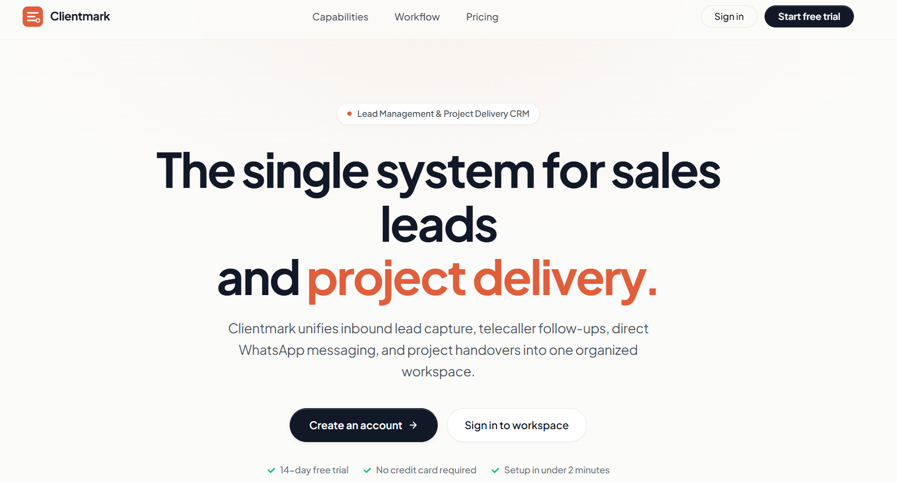

  <h1>Clientmark</h1>

  

    <strong>Organize leads. Automate follow-ups. Accelerate conversions.</strong>
  

  

 

## 🌟 Project Summary

**Clientmark** is an enterprise-grade Lead Management and Project Delivery CRM designed to empower sales teams, telecallers, and project managers. It consolidates sales pipelines, team follow-ups, WhatsApp communication, and project handovers into a fast, unified workspace.

It is built for two primary real-world workflows:

1. **Lead Pipeline & Sales Acceleration** — capture inquiries, assign leads to telecallers and BDEs, manage interaction stages, and track conversion velocity.
2. **Project Delivery & Client Handover** — instantly convert closed deals into active projects with milestones, team tasks, timeline tracking, and live client previews.

## ✨ Features

### 🎯 Lead Pipeline & Sales Management
- **Visual Sales Pipeline**: Drag-and-drop Kanban & tabular lead views across stages (New, In Discussion, Negotiation, Won, Lost).
- **Automated Allocation**: Distribute incoming leads across telecallers and BDEs with custom rules.
- **Detailed Interaction History**: Log calls, notes, follow-up dates, and activity logs for every lead.
- **Smart Filters & Search**: Rapidly segment leads by source, branch, status, assignee, and date range.

### 📞 Telecaller & BDE Dashboards
- **Calling Interface**: In-app calling modal with call disposition status, timer, and notes.
- **Target Tracking**: Daily call quotas, pending follow-ups, and individual conversion metrics.
- **Follow-up Reminders**: Notification panel ensuring zero dropped leads or missed callbacks.

### 💬 WhatsApp Communication & Templates
- **Direct WhatsApp Chat**: Engage leads directly via WhatsApp without leaving the CRM.
- **Pre-approved Templates**: Send instant greetings, quotes, brochures, and follow-up reminders.
- **Chat History**: Store complete conversation logs for team-wide context and audit trails.

### 🚀 Project Management & Handover
- **1-Click Deal-to-Project Conversion**: Convert won leads into managed projects with prefilled client details.
- **Milestones & Tasks**: Track phase deliverables, deadlines, and developer assignees.
- **Public Client Preview**: Share a secure, branded live preview link with clients to inspect progress in real time.

### 🛡️ Multi-Tenant & Role-Based Access Control (RBAC)
- **Granular Permissions**: Restrict actions by roles (Admin, BDE, Telecaller, Developer).
- **Branch & Tenant Isolation**: Securely partition branch offices and client organizations.
- **Custom Branding**: Tenant-specific themes, brand colors, custom logos, and dynamic favicons.

### 📊 Real-Time Analytics & Reports
- **Executive Analytics**: Real-time charts on pipeline value, conversion rates, and revenue ROI.
- **Performance Leaderboards**: Evaluate telecaller talk times and BDE closing ratios.
- **Export Capabilities**: Download lead, project, and telecaller reports in CSV and Excel.

---

## 🛠️ Tech Stack

- **Frontend**: React 18, Vite, CoreUI, Framer Motion, Bootstrap 5, Redux, React Router 6, AG Charts
- **Backend**: Node.js, Express.js, MongoDB (Mongoose), Socket.io, JWT Authentication, Multer
- **Integrations**: WhatsApp Cloud API, Dynamic Favicon & White-labeling engine